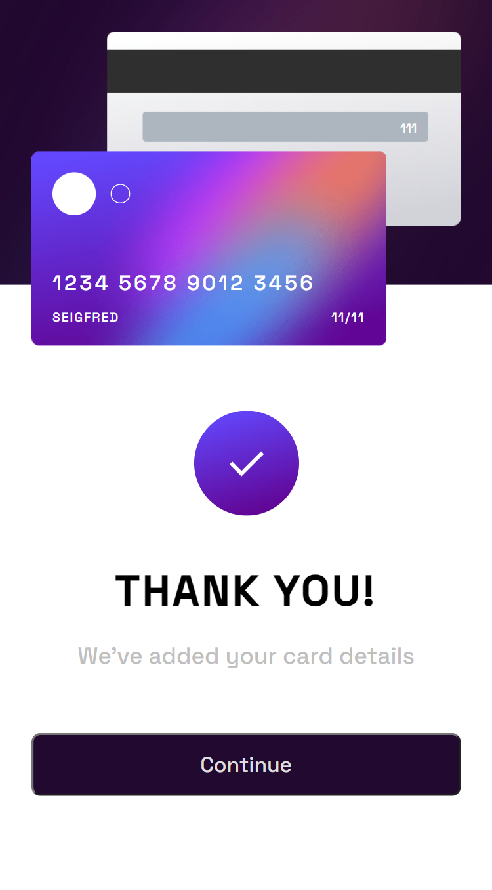

## Welcome! 👋

### Expected behaviour

- Update the details on the card as the user fills in the fields
- Validate the form fields when the form is submitted
- If there are no errors, display the completed state
- Reset the form when the user clicks "Continue" on the completed state

## Link to my project

